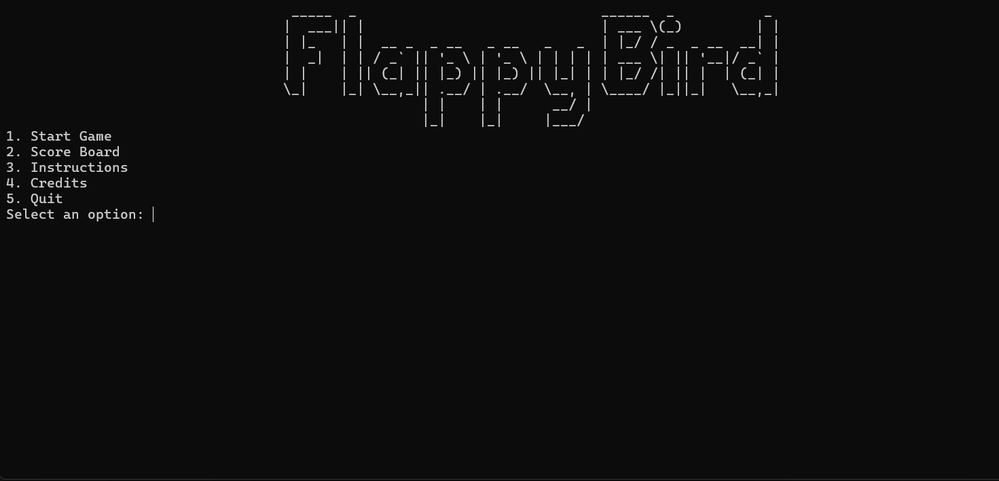
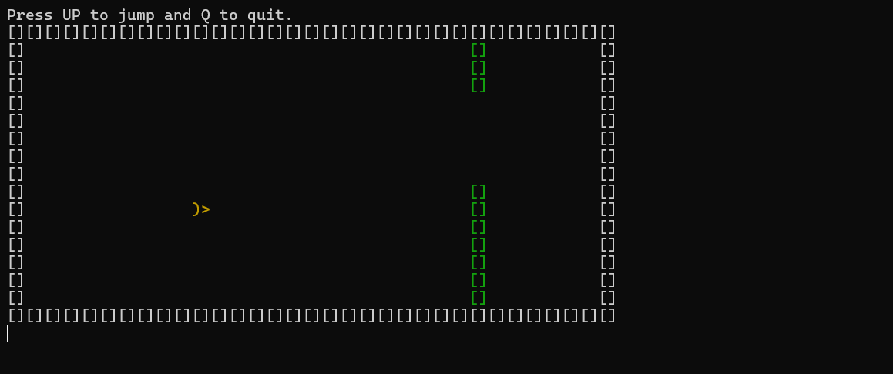
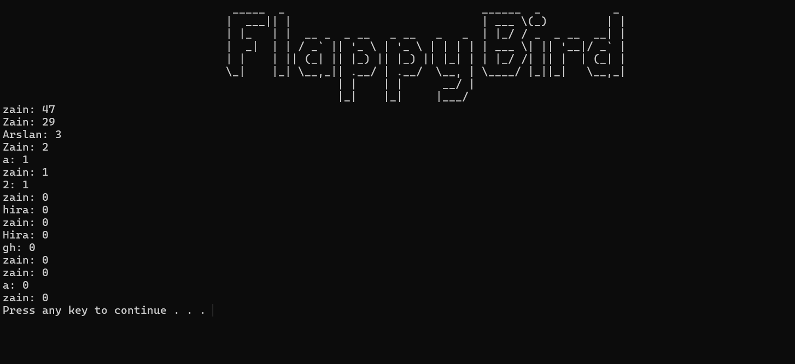

# Flappy Bird in C

A console-based Flappy Bird game written in C as a Programming Fundamentals semester project.
Includes a menu system, difficulty modes, sound effects, scoring, and a power-up feature.

## Features

- Console-based gameplay
- Random pipe generation
- Easy, Medium, and Hard difficulty modes
- Score tracking and leaderboard
- Sound effects and background music
- Power-up for bonus points
- Replay option after game over

## Screenshots

Add screenshots in a folder like screenshots/ and link them here:





## Project Structure

```text
flappy-bird-c/
  README.md
  .gitignore
  scores.txt
  FlappyBird_Final.c
  assets/
    hit.wav
    powerup.wav
    quack.wav
    title_song.wav
```

## Requirements

- Windows OS
- GCC or MinGW compiler
- Terminal with ANSI escape support

## Build

Run from the project root:

```bash
gcc FlappyBird_Final.c -o FlappyBird.exe -lwinmm
```

## Run

```bash
FlappyBird.exe
```

## Controls

- Up Arrow - Jump
- Q - Quit during gameplay

## Notes

- Keep the assets/ folder in the same directory as the executable.
- This project uses windows.h, GetAsyncKeyState, Sleep, and PlaySound, so it is Windows-specific.
- Do not upload the compiled .exe file to GitHub.

## Credits

- Zain Ul Hassan
- Hira Tauseef
- Arslan Khan
